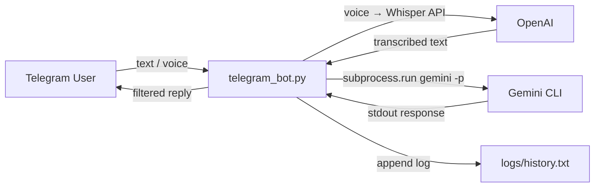

# Project Analysis: Gemini Telegram Bot

## 📋 Overview

| Property | Value |
|---|---|
| **Repo** | [websalesbooster/GemCLI_TG_access](https://github.com/websalesbooster/GemCLI_TG_access) |
| **Branch** | `main` (only branch, clean working tree) |
| **Commits** | 2 total |
| **Main file** | [telegram_bot.py](file:///e:/GeminiCLI_Projects/gemini_telegram_bot/telegram_bot.py) (295 lines) |
| **Language** | Python |
| **Architecture** | Single-file monolith |

## ✅ What's Working Well

- **Clean git state** — `main` is up to date with `origin/main`, no uncommitted changes. Good starting point for branching.
- **Clear README** — Well-documented in Russian with architecture diagrams, setup instructions, troubleshooting, and technical details.
- **Sensible `.gitignore`** — Covers `.env`, logs, `__pycache__`, temp media files, OS artifacts.
- **Simple architecture** — Each message is a standalone `gemini -p "..."` subprocess call. Easy to reason about, no persistent process management.
- **Error handling** — Retries on Whisper API, timeouts on subprocess calls, system message filtering.

## ⚠️ Issues & Concerns

### 🔴 Critical: API Keys Exposed

The [.env](file:///e:/GeminiCLI_Projects/gemini_telegram_bot/.env) file contains **live API keys** (Telegram bot token + OpenAI API key). While `.env` is in `.gitignore`, the keys are visible in the workspace. If this file was ever committed or pushed, the keys are compromised.

> **Action**: Verify these keys were never committed to git. Consider rotating them. Never share `.env` contents in documentation or logs.

### 🟡 Deprecated OpenAI API Usage

[telegram_bot.py:170](file:///e:/GeminiCLI_Projects/gemini_telegram_bot/telegram_bot.py#L170) uses the **old-style** OpenAI API:
```python
openai.Audio.transcribe("whisper-1", audio_file)
```
This is the legacy `openai < 1.0` syntax. The current OpenAI Python SDK (v1.x+) uses:
```python
client = openai.OpenAI()
client.audio.transcriptions.create(model="whisper-1", file=audio_file)
```
The `requirements.txt` doesn't pin versions, so a fresh `pip install` will get the new SDK and **this code will break**.

### 🟡 Blocking Subprocess in Async Context

[send_message()](file:///e:/GeminiCLI_Projects/gemini_telegram_bot/telegram_bot.py#L92-L147) is declared `async` but calls `subprocess.run()` which is **synchronous and blocking**. This will freeze the entire bot while waiting for Gemini CLI to respond (up to 60 seconds). For a single-user bot this is acceptable, but it won't scale.

### 🟡 Blocking Sleep in Async Function

[transcribe_with_retry()](file:///e:/GeminiCLI_Projects/gemini_telegram_bot/telegram_bot.py#L167-L176) uses `time.sleep(delay)` instead of `await asyncio.sleep(delay)`, which also blocks the event loop.

### 🟡 No Conversation Context

Each message is sent as an isolated `gemini -p "..."` call. Gemini CLI has no memory of previous messages in the conversation. The bot functions as a stateless Q&A relay, not a conversational assistant.

### 🟡 Unpinned Dependencies

[requirements.txt](file:///e:/GeminiCLI_Projects/gemini_telegram_bot/requirements.txt) has no version pins:
```
python-telegram-bot
openai
python-dotenv
psutil
```
This makes builds non-reproducible and risks breaking changes (especially the OpenAI SDK issue above).

### 🟢 Minor: Unused Imports

[telegram_bot.py](file:///e:/GeminiCLI_Projects/gemini_telegram_bot/telegram_bot.py#L1-L16) imports `threading`, `queue`, `json`, `re`, `platform`, and `asyncio` — none of which are used in the current code. These are likely leftovers from a previous architecture iteration.

### 🟢 Minor: Documentation Drift

- The README references a `docs/` directory in the file structure section, but no `docs/` directory exists.
- [project_description.md](file:///e:/GeminiCLI_Projects/gemini_telegram_bot/project_description.md) describes the project as being in a debugging phase ("Проблема: Возникает ошибка при отправке голосового сообщения"), which seems outdated given the v2.0 rewrite.

## 🏗️ Architecture Summary



**Single file, single process, stateless relay.** No database, no session management, no user access control.

## 🌿 Readiness for Feature Branching

**Good news**: The project is in a clean state and well-suited for branching.

| Consideration | Status |
|---|---|
| Clean working tree | ✅ Yes |
| Single `main` branch | ✅ Simple, no conflicts |
| Small codebase (1 file) | ✅ Low merge conflict risk |
| No CI/CD | ℹ️ No automated checks on PRs |
| No tests | ⚠️ No safety net for regressions |

### Recommended Branching Strategy

For a project this size, a simple **feature-branch workflow** is ideal:

```
main (stable, working)
 └── feature/your-feature-name
      └── work, commit, test
           └── merge back to main
```

### Suggested naming conventions:
- `feature/conversation-context` — add multi-turn memory
- `feature/async-subprocess` — fix blocking calls
- `feature/openai-v1-migration` — update to new SDK
- `feature/user-access-control` — whitelist users
- `feature/modular-refactor` — split monolith into modules

## 💡 Recommendations Before Starting New Features

1. **Pin dependencies** in `requirements.txt` to avoid surprise breakage
2. **Fix the OpenAI API** to v1.x syntax (or pin `openai<1.0` if you want to defer)
3. **Add a basic test** — even a smoke test that imports the module without errors
4. **Consider splitting the monolith** — separate `GeminiCLIManager`, handlers, and config into their own files before the codebase grows
5. **Rotate API keys** as a precaution since they are visible in the workspace
